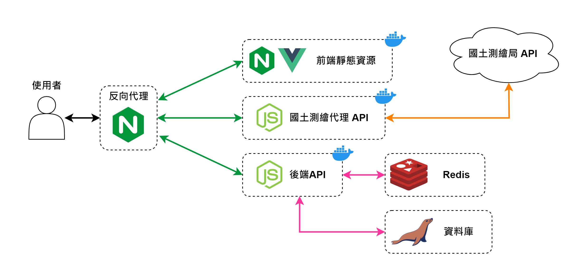

我們採用前後端分離架構，前端使用 vue 作為開發框架，Nginx 作為網頁伺服器。  
後端使用 Node.js 及 TypeScript 開發 API，資料庫使用 MariaDB。  
前後端透過 RESTful API 架構進行溝通。

## 所需技術
前端: `Node.js`, `TypeScript`, `vue3`, `vite`, `Nginx (Web Server)`  
後端: `Node.js`, `TypeScript`, `Nginx (Reverse Proxy)`, `Docker`, `MariaDB`, `Linux`  
Server: `RockyLinux9`, `Certbot`  
文檔: `React`, `Docusaurus v2`  

## 架構說明

### 前端
前端使用 `vue3` 進行開發，使用 `vite` 作為構建工具，將開發完成的使用 `vite` 將編譯打包成 HTML 以及 `Nginx` (作為 web server 運行)封裝成 Docker 容器。  

### 後端
後端使用全 `TypeScript` 開發 (ES2022)，並將後端 API 服務封裝成 Docker 容器。  

國土測繪代理 API 用於處理國土測繪局 API 有限定請求來源，所開發的代理 API。提供的地圖 API 處理農地地圖資訊。  

### Server
使用 `RockyLinux9` 運行，將以上服務都封裝成 Docker 容器運行，確保運行環境的一致性及隔離性。所有請求都透過 `Nginx Reverse Proxy` 進行轉發。  
使用 `Certbot` 處理 SSL 憑證的申請與自動續約。

### 文檔
文檔網站則是使用 `React`, `Docusaurus v2` 進行架設，內容為 API datasheet、前後端配置及筆記。  

