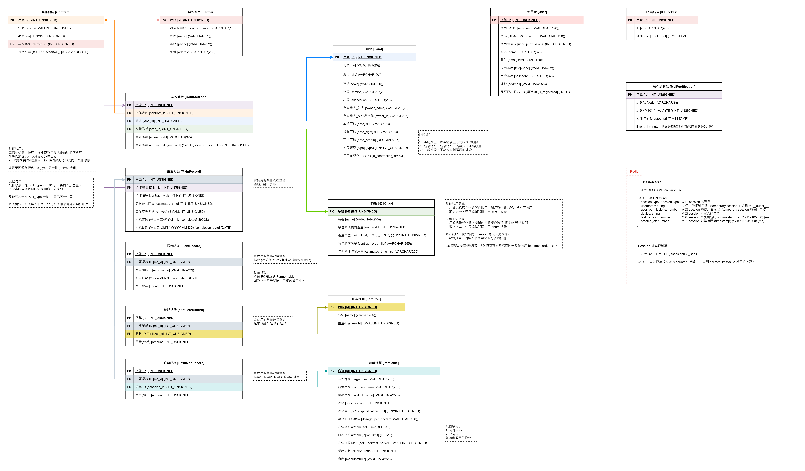

### 架構圖



------------------------------  

### 資料型態

|數值|bytes|範圍|
|:-:|:-:|:-:|
| TINYINT | 1 | -128 到 127 |
| SMALLINT | 2 | -32,768 (-2^15) 到 32,767 (2^15 – 1) |
| MEDIUMINT | 3 | -8,388,608 到 8,388,607 |
| INT | 4 | -2,147,483,648 (-2^31) 到 2,147,483,647 (2^31 – 1) |
| BIGINT | 8 | -9,223,372,036,854,775,808 (-2^63) 到 9,223,372,036,854,775,807(2^63-1) |
|  |  |  |
| TINYINT_UNSIGNED | 1 | 0 到 255 |
| SMALLINT_UNSIGNED | 2 | 0 到 65535 |
| MEDIUMINT_UNSIGNED | 3 | 0 到 16,777,215 |
| INT_UNSIGNED | 4 | 0 到 4,294,967,295 |
| BIGINT_UNSIGNED | 8 | 0 到 18,446,744,073,709,551,615 |  

### 日期型態

|日期|bytes|內容|
|:-:|:-:|:-:|
| DATE | 3 | YYYY-MM-DD |
| DATETIME | 8 | YYYY-MM-DD HH:MI:SS |
| TIMESTAMP | 4 | YYYY-MM-DD HH:MI:SS |
| TIME | 3 | HH:MI:SS |
| YEAR | 1 | YYYY |

### 字元型態

|字元|類型|長度|
|:-:|:-:|:-:|
| CHAR | 固定長度 | 0 到 255 |
| VARCHAR | 可變長度 | 0 到 65,535 |

<details> 
    <summary>▶點開詳細說明</summary>
CHAR 是固定長度的字串類型，你必須在建立表格時設定該欄位的長度，且不論實際存入的字串長度為多少，該欄位始終會保持固定長度。

例如，如果你將一個長度為 10 的 CHAR 欄位儲存一個長度為 5 的字串，該欄位實際上會被填充 5 個空格以達到 10 個字元的長度。

VARCHAR 是可變長度的字串類型，你也必須在建立表格時設定該欄位的最大長度，但是當實際存入的字串長度不足最大長度時，
該欄位實際儲存的字串長度就會根據實際存入的字串長度而變化。

例如，如果你將一個最大長度為 10 的 VARCHAR 欄位儲存一個長度為 5 的字串，該欄位實際上只會儲存這 5 個字元。

總體來說，CHAR 比 VARCHAR 更適合儲存固定長度的字串，而 VARCHAR 更適合儲存可變長度的字串。

但是，由於 VARCHAR 需要動態調整儲存空間，因此在某些情況下可能會對性能造成一定的影響，例如當儲存大量的 VARCHAR 欄位時。
</details>

------------------------------  

### 帳號

權限設置語句

```sql
CREATE USER 'test_user'@'localhost' IDENTIFIED BY 'your_password';
GRANT ALL PRIVILEGES ON test_db.* TO 'test_user'@'localhost';
FLUSH PRIVILEGES;
```